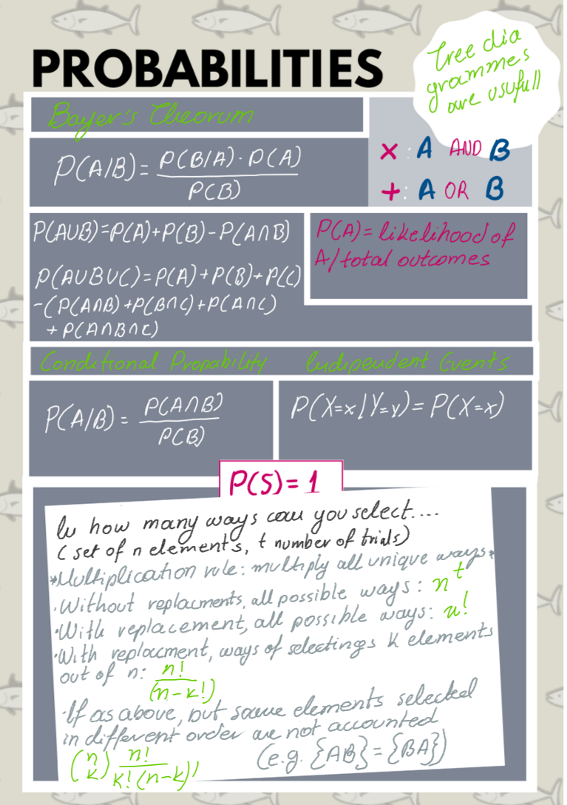
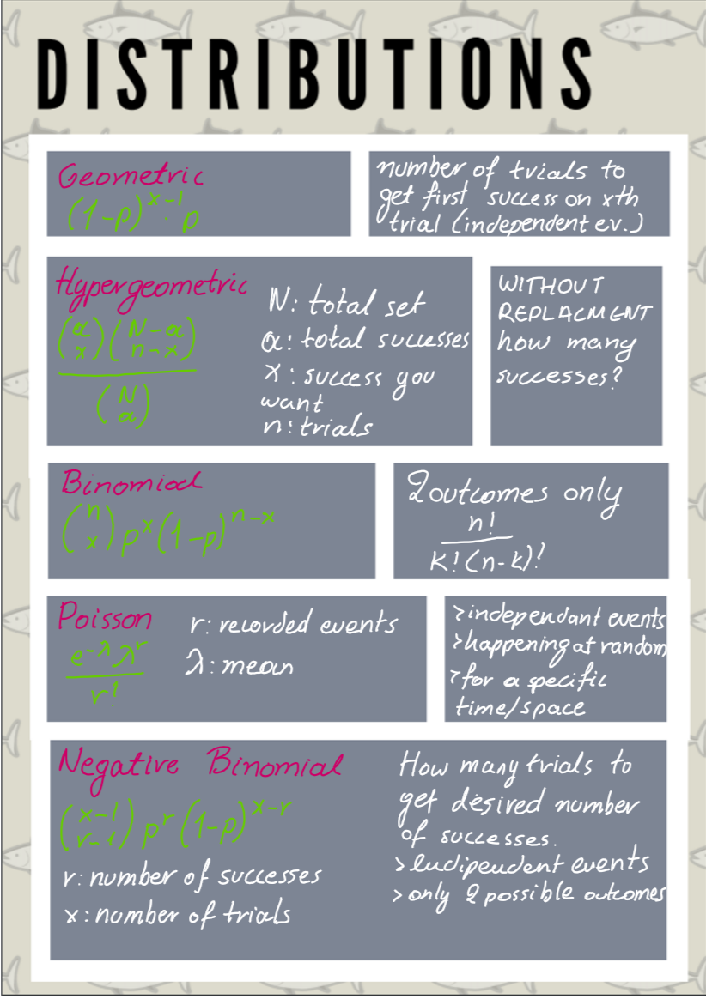

# Basic Statistics and Probabilities Review

## A useful cheatsheet in Probabilities



## A useful cheatsheet in Distributions



## Basic probability exercises

### Coin tossing:

We are going to try and examine if the probability of getting heads or tails when tossing a coin if 0.5 by
conducting n Bernoulli trials, summing the results of heads or tails and seeing if they are about half


```{r}
#using the random number generator
N <- 100
#will return true (1) if the output from 0 to 1 is >0.5
flips <- runif(N, min=0, max=1)>0.5
#we sum them up, it will add all the ones for true and zero's for false of the above list of flips
#so we expect half of them to be true and so to get a result close to 0.5
#we can increase the N to get closer
sum(flips)/N

#using sample function to perform a simulation
sample.space <- c(0,1)
flips <- sample(sample.space, N, replace = TRUE, prob = c(0.5, 0.5))
sum(flips)/N
```

### The famous birthday problem:


Finding the probability that at least two people having the same birthday from a sample of n people.
we ignore leap years, seasonal variations


All the probable birthdays of the people would be 365^k if everyones birthday was unique (no one has the same birthday), there would be factorial(365)/factorial(365-k) ways for that to be true, from the permutations formula so the probability that at least two people have the same birthday would be 1 - (probability no one having the same birthday)

```{r eval=FALSE}
#this library allows us to use larger numbers
install.packages("Rmpfr")
```
```{r}
library("Rmpfr")

#create function to calculate permutations, this is the standard formula however we use the rmpfr library
#that will let us deal with larger numbers
perm <- function(n, k) {
  factorialMpfr(n)/factorialMpfr(n-k)
}

#this is our n
count <- 100
#double so we can plot it
p <- double(count)

for(k in 1:count){
  #the formula from above
  d<-(1 - perm(365, k)/ (mpfr(365, precBits = 1024)^k))*100
  p[k] <- asNumeric(d)
}

plot(1:count, p, xlab="number of people", ylab ="probability in %")
```

## Understanding P-values
The p value if used to decide whether an Ho should be accepted or rejected. It is related to the probability of the event happening, assuming it is random (h0 is true) BUT it does not always equal that.

p-value is : probability of event happening at random + probability of all other events of an equal chance + probability of all events that are less likely to happen

```{r}
#let's take the example of tossing a coin and landing 5 heads on a row, what is the p-value
possibleOutcomes<- 2^5
possibleOutcomes
P4heads <- 1/possibleOutcomes
P4heads
#the probability of landing 5 tails in a row is equally likely
P4tails <- 1/possibleOutcomes
#there is no other outcome less likely so we can get the p value from
pValue <- P4heads + P4tails
pValue
#the probability was 0.031, however the p-value is 0.03, which is less than the usual threshold of 0.05 and so we could accept the H0
#this could occur at random

#what would the p value be if we got 4 heads and 1 tail
WaysForHeads1tail <- factorial(5)/factorial(4)*factorial(5-4)
P4heads1tail <- WaysForHeads1tail/possibleOutcomes
P4heads1tail
#the probability of something equally likely having (4 tails and 1 head)
P4tails1head <- P4heads1tail
#probability of something less likely happening (5 heads or 5 tails), is already calculated so p would be:
pValue <- P4heads1tail + P4tails1head + P4heads + P4tails
#also quite high so event could easily occurs at random
pValue

#what if we were dealing with continuous distributions, e.g hight measurements?
#in this case we use a density function where the area under the graph represents the probability for that x1 to x2 occurring.

#if we had the following height sample, what is the probability of a person having a height from 1.60 to 1.68
heights <- c(1.50, 1.45, 1.54, 1.60,1.61,1.62,1.66,1.64,1.66, 1.66, 1.66, 1.66, 1.69, 1.70, 1.71, 1.72, 1.73, 1.74, 1.75, 1.80, 1.85, 1.90)

#this how the graph looks like, where the blue line represents the pdf (probability density function)
#assuming the heights of the population follows a normal distribution
h<-hist(heights, breaks=10, col="red")
xfit<-seq(min(heights),max(heights),length=40)
yfit<-dnorm(xfit,mean=mean(heights),sd=sd(heights))
yfit <- yfit*diff(h$mids[1:2])*length(heights)
lines(xfit, yfit, col="blue", lwd=2)

# generally we can get the area under the graph by calculating the integral from x1 to x2, in a normal distribution we can use the z scores instead
#to calculate the area from an x point to the mean, by relating to the standard normal distribution. We also know that the total area which represents
#all the probabilities would be one, also the area from the left or right to the mean would be 0.5 due to the symmetry.

#so in order to get what we are looking for we need to add the area from x1 to the mean and the area from x2 to the mean
m <- mean(heights)
s <- sd(heights)
m
#from x1 to m
#the score is
z1 <- (1.60-m)/s
#the area from z1 to end
areaX1ToEnd <- pnorm(z1)
areaX1ToEnd
#knowing that the aria from the mean to the end is 0.5, then the area from the mean to x1 is
areaX1 <- 0.5 - areaX1ToEnd
areaX1
#from x2 to m
z2 <- (1.68-m)/s
areaX2ToEnd <- pnorm(z2)
areaX2ToEnd
areaX2 <-  areaX2ToEnd -0.5
areaX2
#since the one x is on the left of the mean and the other on the right we can just add them, otherwise we would have to also remove a common area
TotalArea <- areaX1+areaX2
TotalArea
#that is equal to 30% probability that a persons hight is exactly in-between 1.60 to 1.68
#to measure the p value we need to also measure the probability of someone having a height less that 1.60
areaX1ToEnd
#and the probability of someone having a height greater than 1.68
areaX2ToEnd
#and add them up
pValue <- TotalArea + areaX1ToEnd + areaX2ToEnd
pValue
#that is a large p value and therefor shows that having a height close to the mean is not uncommon
```

## Confidence Intervals Problems

### Confidence Intervals with t-values

```{r}
#the test scores of 9 randomly selected students are 83, 73, 71, 77, 77, 59, 92
#Compute the 99% confidence interval of the true mean.

studentScores <- c(83, 73, 71, 77, 77, 59, 92)
scoreMean <- mean(studentScores)
n <- length(studentScores)

#since we do not know the standard deviation of the actual population, rather we only know the s of the sample and our sample n<30 we will use t
# values to calculate the error
error <- qt(0.99,df=n-1) * sd(studentScores)/sqrt(n)

#so then our value is the sample mean +/- he error
left <- scoreMean - error
right <- scoreMean + error
left
right
```

#### Confidence Intervals with s-values

```{r}
#Estimate the avarage weight for the adult male population.The avarage weight of 100 randomly selected adult males is 180lbs. Assume a population
#standard deviation of 20lbs. Compute a 95% confidence interval for the population avarage weight.

n <- 100
meanWeight <- 180
sPopulation <- 20

#we can calculate the interval from a normal distribution
error <- qnorm(0.95)* sPopulation/sqrt(n)
left <- meanWeight - error
right <- meanWeight + error
left
right

```

## Chi-squared test

### Chi-squared test manually step by step example


```{r}
#We want to find whether a dice is fair or not. The observed values were 22 for 1, 24 for 2, 38 for 3, 30 for 4, 46 for 5, 44 for 6.


####################### First step: state the null and alernative hypothesis############################################

#H0(null hypothesis): dice is fair so p=1/6
#Ha(alternative hypothesis): dice is not faire  p != 1/6

trialDice <- matrix(c(22,24,38,30, 46, 44), ncol=6)
colnames(trialDice) <- c(1,2,3,4,5,6)
rownames(trialDice) <- c("frequencies")
trial.tableDice <- as.table(trialDice)
trial.tableDice

n <- sum(trial.tableDice["frequencies",])
expectedFr <- 1/6*n
####################### Second step: choose the level of significance (a) #############################################

#a is the area under the curve in each tail where if ou result lies the H0 will be rejected (rejectipon region), in this case this is not given to use.
#We will use a=0.01 for
a <- 0.01


####################### Third step: Find critical value ###############################################################

#critical value is the point (z value) that separates the tails as defined from a to the main curve
#the standard deviation of the population is given so we will use a  z test
#(1-0.01)for R
criticalValue <-qchisq(0.99, df=5)
criticalValue
####################### Four step: Find test statistic ###############################################################

tStat = sum((trial.tableDice["frequencies",]- expectedFr )^2)/expectedFr
tStat
####################### Five step: Draw a conclusion ###############################################################

# tsat<criticalValue and so it falls in the rejected area, so we can reject the null hypothesis and accept the Ha

```

### Chi-squared test with contigency tables, manual step-by-step example

```{r}
#Does the sex of a person affects their choise of political part they support. We have 26 male rep, 13 male dem, 5 male other and
#20 female rep, 29 female dem, 7 female other

####################### First step: state the null and alernative hypothesis############################################

#H0(null hypothesis): not affected
#Ha(alternative hypothesis): affected

#create our contingency table
trial <- matrix(c(26,20,13,29, 5, 7), ncol = 3)
colnames(trial) <- c("rep", "dem", "other")
rownames(trial) <- c("males", "females")
trial.table <- as.table(trial)
trial.table

totalFemales <- sum(trial.table["females",])
totalMales <- sum(trial.table["males",])
totalRep <- sum(trial.table[,"rep"])
totalDem <- sum(trial.table[,"dem"])
totalOther <- sum(trial.table[,"other"])
totalSubjects <- totalFemales + totalMales

#expected values if Ho holds
ExpMaleRep <- totalMales * totalRep / totalSubjects
ExpMaleDem <- totalMales * totalDem / totalSubjects
ExpMaleOther <- totalMales * totalOther / totalSubjects
ExFemaleRep <- totalFemales * totalRep / totalSubjects
ExFemaleDem <- totalFemales * totalDem / totalSubjects
ExFemaleOther <- totalFemales * totalOther / totalSubjects

exp <- matrix(c(ExpMaleRep,ExFemaleRep,ExpMaleDem,ExFemaleDem,ExpMaleOther,ExFemaleOther), ncol=3)
colnames(exp) <- c("rep", "dem", "other")
rownames(exp) <- c("males", "females")
exp.table <- as.table(exp)
exp.table
####################### Second step: choose the level of significance (a) #############################################

#a is the area under the curve in each tail where if ou result lies the H0 will be rejected (rejectipon region), in this case this is not given to use.
#We will use a=0.05 for

#example chi square distribution for visibility
x <- rchisq(100, 5)
hist(x, prob=TRUE)
curve( dchisq(x, df=5), col='green', add=TRUE)
#aria after red line falles in rejectred area (this is an example)
abline(v=10, col="red")

a <- 0.05

####################### Third step: Find critical value ###############################################################

#critical value is the point (z value) that separates the tails as defined from a to the main curve
#the standard deviation of the population is given so we will use a  z test
#(1-0.05)for R
criticalValue <-qchisq( 0.95, df=2)
criticalValue
####################### Four step: Find test statistic ###############################################################

eachExquaer = (trial.table - exp.table )^2/exp.table
tStat <- sum(eachExquaer)
tStat
####################### Five step: Draw a conclusion ###############################################################

# tsat>criticalValue and so it does not falls in the rejected area, so we can accept the null hypothesis and we cannot accept the Ha

######################################################################################################
########################## CHI-SQUARE TEST Of INDEPENDANCY IN R ######################################
######################################################################################################

chisq.test(trial.table)
#this returned our x-squared value wich validated our t-statistic and a p-value of 0.05352, which is significant and therefore we can not reject the H0


chisq.test(trial.table)$expected
#this returns the expected values, it validetes the ones we calculated previously on exp.table and it can be used to compere with our actual values

#to confirm this
Rexpected <- chisq.test(trial.table)$expected
#returns true for all values :) :)
Rexpected == exp.table

#lets make some charts
barplot(trial.table, legend= TRUE, beside = T)

```

### Chi-square goodness of fit in R

```{r}
#we use the dice example again
frequenciesGiven<- c(22,24,38,30, 46, 44)
#calculated on top of the page
pForEach<- c(1/6,1/6,1/6,1/6, 1/6, 1/6)

#this validates our previous results and so it gives a p=0.009177 which is a very small probability for the H0 to be tru, therefore we accept the Ha
chisq.test(frequenciesGiven, p=pForEach)
```

### Fisher's Exact test in R

```{r}
#this is used for non-parametric data (not following a normal distribution)
#legend has it, it was discovered when testing if a lady in the UK could tell if milk was poured before or after
#so lets take this example. Assume 20 trials out of which the lady gets guesses 9 times correctly that tea was poured before, out of the 10 in which it actually was.
n <- 20
s <- 9
milkBefore <- 10

#there are 4 ways out of 8 to choose the tea that was made with milk before tea
comb = function(n, x) {
  factorial(n) / (factorial(n-x) * factorial(x))
}

totalWays <- comb(n,milkBefore)
totalWays
#the lady got 4, so we need to calculate in how many ways she could have gotten 4 out of 5
#there are ten ways in 10 orders
waysToGuessSuccess <- 10*10
waysToGuessSuccess
#if we assume the H0, the probability that she got it correctly at random would be:
p <- waysToGuessSuccess / totalWays
p
# p= 0.02, which is quite small smaller that 0.05 which is usually the threshold so we can reject the H0. According to this trial the lady can, most likely,
#tell whether or not milk was poured before or after the tea

#let's try this using R built in functionality
TeaTasting <-
  matrix(c(9, 1, 1, 9),
         nrow = 2,
         dimnames = list(Guess = c("Milk", "Tea"),
                         Truth = c("Milk", "Tea")))

fisher.test(TeaTasting, alternative = "greater")

```

## Anova

### Two-way ANOVA with interaction testing

```{r}
#built in data set
head(warpbreaks)
summary(warpbreaks)

#standard model
model1 <- aov(breaks ~ wool + tension, data = warpbreaks)
#we can see that tension is significant to the breaks
summary(model1)

#add an interaction manually, product of wool and tension
model2 <- aov(breaks ~ wool + tension + wool:tension, data = warpbreaks)
#we see that the interaction of wool with tension (combination) is fairly significant
summary(model2)

#check for all interactions, should return the same model
model3 <- aov(breaks ~ wool * tension, data = warpbreaks)
summary(model3)
```

### Manual step-by-step example

```{r}
#this is a balanced test since for every poisson the same amount of tests/treatments were used
survivalTimeDS <- read.csv("data/poison_balanced.tsv", sep="")

#we can see the boxplot to get an idea of the variance
boxplot(survivolTime~ treatment* poison ,data=survivalTimeDS)

summary(survivalTimeDS)

#H0: type of poison has no affect
#H0: type o treatment has no affect
#H0: combination of poison and type has no affect

############################ inspect the mean survival time for each combination #######################################
library(plyr)
#per poison
meanPerPoison <-ddply(survivalTimeDS, .(poison), summarize, mean=mean(survivolTime))
meanPerPoison
#per treatment
meanPerTreatment <-ddply(survivalTimeDS, .(treatment), summarize, mean=mean(survivolTime))
meanPerTreatment
#for each poisson each treatment
meanPoisonTreat <-ddply(survivalTimeDS, .(treatment, poison), summarize, mean=mean(survivolTime))
meanPoisonTreat
#total
meanTimeForAll <- mean(survivalTimeDS$survivolTime)
meanTimeForAll

##########################Sum square of first factor(poison)#############################################################

#this is given by calculating the squared difference of the grand mean to the mean for each
#poison and then summing the result

#for robustness we make a function that selects the mean for a given poison and does the calculations
sumOfSquaresForPoisonF <- function(poisonGiven){
  #we multiply by 4 because we have 4 treatments per poison
  4*(((subset(meanPerPoison,poison==poisonGiven,select="mean"))[1,]-meanTimeForAll)^2)
}
#then we apply this function for poison 1,2,3 and sum the result
sumOfSquaresForPoison <- sum(mapply(sumOfSquaresForPoisonF, c(1,2,3)))


##########################Sum square of second factor(treatment)######################################################
#as above but for treatments this time

sumOfSquaresForTreatmentsF <- function(treatmentGiven){
  #we multiply by 3 because we have 3 poisons per treatment
  3*(((subset(meanPerTreatment,treatment==treatmentGiven,select="mean"))[1,]-meanTimeForAll)^2)
}


sumOfSquaresForTreatments <- sum(mapply(sumOfSquaresForTreatmentsF, c("A", "B", "C", "D")))
sumOfSquaresForTreatments
########################## Sum square within error ######################################################################

#This is the square sum for each survival time in our dataset minus the average for that poison and treatment

sumOfSquaresWithErrorF <- function(treatmentGiven, poisonGiven){
  subTrPoi <- subset(survivalTimeDS, treatment==treatmentGiven & poison== poisonGiven)
  meanOfTrPoi <- subset(meanPoisonTreat, treatment==treatmentGiven& poison== poisonGiven,select="mean")
  sumTrPoi <- sum((subTrPoi$survivolTime - meanOfTrPoi)^2)
  return(sumTrPoi)
}
#to get all combinations A1, A2,A3,B1....we need to use outer product
x <- factor(c("A", "B", "c", "D"))
y <- c(1,2,3)
product <- expand.grid(x, y)

#apply the function to all possible combinations and sum them up
sumOfSquaresWithError <- sum(mapply( sumOfSquaresWithErrorF,treatmentGiven= as.character(product[1,"Var1"]),poisonGiven=product[1,"Var2"]))
sumOfSquaresWithError
########################## Sum of Square Total ################################
sumSquareTotal <- sum((survivalTimeDS$survivolTime - meanTimeForAll)^2)
sumSquareTotal

######################### sum square of both factors ############################################
#sum of both factors is given by
sumOfSquareBothFactors <- sumSquareTotal - sumOfSquaresWithError -sumOfSquaresForTreatments - sumOfSquaresForPoison

######################### calculating the degrees of freedom for each sum of squares ############

#for first factor (poison)
dfFirstFactor <- 3-1
#for second factor (treatment)
dfSecondFactor <- 4-1
#for within error we add up n-1 of each treatment for each poison so:
#(4-1) a treatment for a poison *3 one treatment for each poison *4 each treatment for each poison
dfWithinError <- (4-1)*3*4
#sum of both squares, we multiply df of first and second
dfSumOfBoth <- dfFirstFactor * dfSecondFactor
#total degree of freedoms, this is the sum of all of them
dfTotal <- dfFirstFactor + dfSecondFactor + dfWithinError + dfSumOfBoth
dfTotal

######################### calculating the mean square of sum of square within error ############

#we will need this to calculate the f-scores which will allow us to draw our conclusions for each H0
#this is the sum of squares within error divided by its degrees of freedom so:
meanSquareOfSumWithinError <- sumOfSquaresWithError/dfWithinError
meanSquareOfSumWithinError

######################### H0: poison does not affect the survival time ############################

#we need to calculate the F-score for this which is meanSquareOfFirstFactor/meanSquareWithinError
#so we need the mean square of 1st factor:
meanSquareOfFirstFactor <- sumOfSquaresForPoison/dfFirstFactor
FscoreForPoison <- meanSquareOfFirstFactor/meanSquareOfSumWithinError
# F(dfFirstFactor ,dfWithinError) = FscoreForPoison p<0.5 for a 95%confidence interval,
#we can find the critical value for df of numerator dfFirstFactor and dfWithinError denominator from the F distribution
cvForPoison <- qf(.95, df1=dfFirstFactor, df2=dfWithinError)
cvForPoison
#FscoreForPoison falls in the rejection area and so we can reject he H0 and accept that the poison does affect the
#survival time

####### you can repeat this for the rest of the H0's ##############################################
### or we can be sensible and use..... r #####

#however you need to ensure your factors are actually of type factor!!!
survivalTimeDS$poison <- as.factor(survivalTimeDS$poison)
modelForSurvivalTime <- lm(survivolTime ~ treatment * poison, data = survivalTimeDS)
#type does not matter since our test is balanced
library(car)
Anova(modelForSurvivalTime, type="III")

#from the above we can reject that poison and treatment has no effect and accept that the interaction has no effect
```
